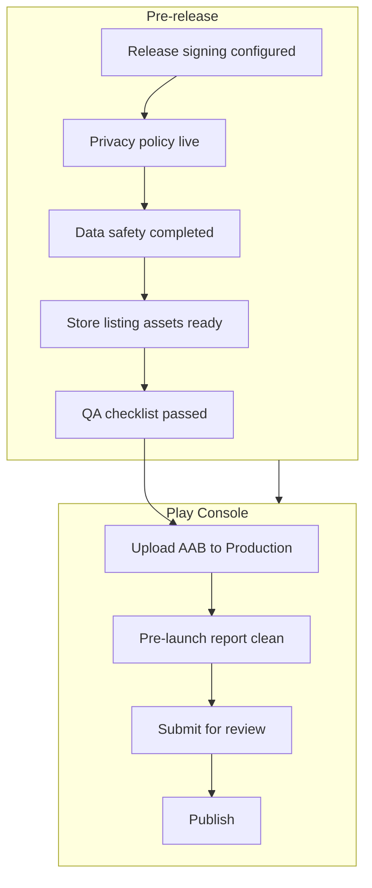

# Iubenda Play Store Demo - Plan

## Goal Capsule

- **Objective:** Ship a production-ready Kotlin CMP SDK demo app to Google Play Production as **Iubenda CMP SDK Demo App**, polished enough for prospects and integrators to install and explore without cloning the repo.
- **Product authority:** Approach B — polished customer demo release (production signing, hidden debug tools, compliance assets, marketing-quality store listing, structured QA before Publish).
- **Open blockers:** Privacy policy URL and completed Data safety form do not exist yet.

---

## Product Contract

### Summary

Publish the Kotlin Compose demo app to Google Play Production under the listing name **Iubenda CMP SDK Demo App**, with release signing, Iubenda-aligned in-app branding, debug tools reachable only via a hidden easter egg, and a polished store presence. The Android `applicationId` stays `net.consentmanager.kmm.cmpsdkdemoapp`. Java demo remains repo-only.

### Problem Frame

The Kotlin demo app showcases consentmanager CMP SDK v3 integration for Android Native developers. Today it is a developer workspace artifact: release builds sign with the debug keystore, debug tools (IAB corrupt, test ad load) appear in the main navigation menu, Firebase config is absent from version control, and the manifest references Google's sample AdMob application ID. There is no CI pipeline, no Play Store release documentation, and no privacy policy or Data safety answers prepared for Google Play compliance.

Prospects and integrators who should evaluate the SDK on a real device currently cannot install a maintained build from the store. Shipping a polished public demo closes that gap while keeping power-user debug capabilities available through a deliberate hidden path.

### Key Decisions

- **Approach B — polished customer demo** over minimum viable release or pipeline-first release. First impression and listing quality matter for a public prospect demo; CI automation is deferred until update cadence justifies it.
- **Kotlin Compose app only on Play Store** over Java demo or dual listings. Kotlin is the primary, actively maintained demo (Compose, current SDK, Firebase/AdMob). Java stays in the repo as integrator reference. *(session-settled: user-directed — chosen over Java-only, both separate, and Kotlin-now-Java-later: Kotlin is the ship target.)*
- **Hidden easter egg for debug tools** over visible debug menu or separate debug/production builds. Prospects see a clean demo; integrators who know the unlock can still reach IAB corrupt and ad-load tools. *(session-settled: user-directed — chosen over hide-all, keep-visible, and separate-builds.)*
- **Keep existing applicationId** over Iubenda namespace rebrand. Store listing uses Iubenda branding; package identity stays `net.consentmanager.kmm.cmpsdkdemoapp` to avoid migration cost and duplicate-listing conflict with the Java module. *(session-settled: user-directed — chosen over rebrand package.)*
- **Direct to Production track** over internal, closed, or open testing tracks. First public release targets Production once QA passes. *(session-settled: user-directed.)*
- **Success bar: Play approved plus polished listing** over Play-approved-only or Play-plus-QA-plus-CI. Store assets and copy are in scope for v1; automated release pipeline is not. *(session-settled: user-directed.)*
- **Public customer demo** as primary audience over internal QA or repo-only reference. The Play Store install is the main distribution path for prospects. *(session-settled: user-directed.)*
- **Production AdMob with real ad unit IDs** over demo/test ads or removing AdMob from the release. Ads are declared in Play Console, privacy policy, and Data safety. *(session-settled: user-directed — chosen over demo-test-ads and remove-ads.)*
- **Configuration screen fully editable** in the public demo over read-only or editable-with-reset. Prospects can change Code-ID, domain, and webview options as an integrator sandbox. *(session-settled: user-directed.)*
- **Keep IAB corrupt debug action** behind easter egg over removing it from the release build. Destructive IAB storage testing stays available to integrators who unlock debug mode. *(session-settled: user-directed.)*

### Actors

- **A1. Prospect / integrator** — installs from Play Store, explores consent flows and SDK behavior on device.
- **A2. consentmanager / Iubenda engineering** — builds signed AAB, runs QA, uploads release, maintains app updates.
- **A3. Legal / compliance** — drafts privacy policy, validates Data safety declarations against actual data collection.
- **A4. Marketing / product** — provides store listing copy, screenshots, feature graphic, and icon if refreshed.

### Key Flows

- **F1. Prospect evaluates SDK via Play Store**
  - **Trigger:** A1 searches for or follows a link to **Iubenda CMP SDK Demo App**.
  - **Actors:** A1
  - **Steps:** Install from Production → launch app → interact with default CMP configuration → accept or reject consent → optionally explore logs tab.
  - **Outcome:** A1 experiences a representative CMP SDK integration without repo access.
  - **Covered by:** R1, R2, R5, R6

- **F2. Integrator unlocks debug tools**
  - **Trigger:** A1 or A2 performs the hidden unlock gesture (e.g., repeated tap on version/build label).
  - **Actors:** A1, A2
  - **Steps:** Unlock debug mode → access previously hidden debug capabilities (demo ad load, IAB storage corrupt) → return to normal demo UI.
  - **Outcome:** Debug capabilities remain available without appearing in default navigation or store screenshots.
  - **Covered by:** R3

- **F3. Engineering ships a Production release**
  - **Trigger:** A2 completes QA and compliance prerequisites.
  - **Actors:** A2, A3, A4
  - **Steps:** Build signed AAB → complete Play Console app setup → upload to Production → resolve Pre-launch report issues → submit for review → publish on approval.
  - **Outcome:** App is publicly downloadable on Google Play.
  - **Covered by:** R4, R7, R8, R9, R10, R11, R12, R13, R16

### Requirements

**Build and release hardening**

- R1. Release builds must be signed with a dedicated upload keystore, not the debug keystore.
- R2. Release builds must produce an Android App Bundle (AAB) suitable for Play Console upload.
- R3. Debug screen and its menu entry must not appear in default navigation; access requires a hidden easter egg unlock that is not documented on the public store listing.
- R4. `versionCode` and `versionName` must be set appropriately for the first Production release and incremented on each subsequent update.
- R17. Upload keystore and credentials must be stored securely with a documented backup; keystore loss blocks all future Play Store updates for this `applicationId`.

**Branding and demo experience**

- R5. User-visible app naming must align with **Iubenda CMP SDK Demo App** where the app presents itself to the user (launcher label, key in-app titles as applicable).
- R6. Default CMP configuration must present a curated, stable demo experience suitable for first launch; the Configuration screen remains fully editable so prospects can test their own Code-ID, domain, and webview settings.
- R7. Store listing copy must explain that the app demonstrates CMP SDK integration and clarify the relationship between Iubenda listing branding and the consentmanager package identity.

**Third-party services**

- R8. A production `google-services.json` for the release Firebase project must be available to release builds (currently gitignored; provision out-of-band).
- R9. AdMob must use production ad unit IDs under a consentmanager/Iubenda AdMob account; Google's sample test application ID must not appear in the Production-bound release manifest.

**Compliance and Play Console**

- R10. A publicly accessible privacy policy URL must exist before Play submission and must cover Firebase Analytics, advertising (if declared), and CMP consent data handling.
- R11. Play Console Data safety form must be completed and must match the privacy policy and actual app behavior.
- R12. Play Console ads declaration, content rating (IARC), target audience (not designed for children), Families policy declaration, and app access sections must be completed for a free demo app with no login gate.

**Store listing quality**

- R13. Store listing must include a short description, full description, contact email, app icon (512×512), feature graphic (1024×500), and at least two phone screenshots showing representative consent and app flows.
- R14. Screenshots and marketing copy must reflect the prospect-facing demo UI, not debug-only screens.

**Quality assurance**

- R15. An internal QA checklist must pass before Publish, covering at minimum: cold start, consent accept and reject paths, configuration changes, device rotation, Firebase connectivity, and ad-load behavior in easter-egg debug mode.
- R16. Pre-launch report findings that indicate crashes or policy-risk behavior must be resolved before submission.

### Acceptance Examples

- **AE1. Default navigation has no debug entry**
  - **Covers:** R3, R14
  - **Given:** A fresh install from a release build
  - **When:** A1 opens the app and uses Home and Logs tabs and the navigation menu
  - **Then:** No Debug menu item or debug tab is visible without performing the easter egg unlock

- **AE2. Easter egg unlock exposes debug tools**
  - **Covers:** R3
  - **Given:** A release build and the unlock gesture performed
  - **When:** A1 or A2 navigates to debug capabilities
  - **Then:** Demo ad load and IAB corrupt actions are reachable as today, but only after unlock

- **AE3. Release artifact is Play-uploadable**
  - **Covers:** R1, R2
  - **Given:** A release build task completes successfully
  - **When:** A2 inspects the output artifact
  - **Then:** A signed AAB is produced and was not signed with the debug keystore

- **AE4. Compliance gate blocks premature submit**
  - **Covers:** R10, R11
  - **Given:** Privacy policy URL is not yet live or Data safety is incomplete
  - **When:** A2 attempts to submit for Production review
  - **Then:** Submission must not proceed until both are complete (Play Console will block or reject)

### Success Criteria

- App is approved and publicly downloadable on Google Play Production under the listing name **Iubenda CMP SDK Demo App**.
- Store listing includes polished copy and visual assets (icon, feature graphic, multiple screenshots) reviewed by marketing/product stakeholders.
- Pre-launch report shows no unresolved crash or critical issue at submission time.
- Internal QA checklist (R15) is signed off by engineering before Publish.

### Scope Boundaries

**In scope for v1**

- Kotlin Compose demo app only
- Manual signed AAB build and Play Console upload
- Privacy policy creation and Data safety completion
- Easter-egg-gated debug tools
- Iubenda-branded listing and in-app naming alignment

**Deferred for later**

- GitLab CI or automated release pipeline (Approach C)
- Java demo Play Store listing
- Closed, open, or internal testing tracks before first Production release
- Package/applicationId migration to an Iubenda namespace

**Outside this product's identity**

- Turning the demo into a general-purpose CMP admin or configuration tool for production customer accounts
- Supporting multiple concurrent Play listings from this repo (Kotlin + Java)

### Dependencies / Assumptions

- consentmanager already holds an active Google Play Console developer account.
- Engineering can create and securely store an upload keystore with backup.
- Play App Signing will be enabled (Google holds app signing key; team retains upload key).
- Legal/compliance can deliver privacy policy URL and Data safety inputs in time for submission.
- Marketing/product can deliver store assets and reviewed copy.
- Production Firebase project and `google-services.json` can be provisioned outside the repo.
- Only one app with `applicationId` `net.consentmanager.kmm.cmpsdkdemoapp` may exist on Play Store; Kotlin variant is the sole listing.

### Outstanding Questions

**Deferred to Planning**

- **Q2. Easter egg mechanism:** Confirm unlock gesture (recommended: repeated tap on version/build label, e.g., seven taps) and whether unlock persists for the session only or until app restart.
- **Q3. Default CMP tenant:** Confirm whether demo Code-ID and domain remain as today or switch to a dedicated production demo tenant (Configuration screen stays fully editable regardless).
- **Q4. Icon refresh:** Reuse current launcher icon or commission Iubenda-branded icon for store and in-app use.

### Play Store Setup Checklist

Reference sequence for A2 when executing F3 (not implementation detail — operational guide for the release owner):

1. **Create app** in Play Console → name **Iubenda CMP SDK Demo App** → App, Free, default language.
2. **Main store listing** — descriptions, icon, feature graphic, screenshots, contact email (R13).
3. **App content** — privacy policy URL (R10), ads declaration, app access (no restrictions unless gating added), content rating questionnaire, target audience, Data safety (R11, R12).
4. **Release → Production** — upload signed AAB (R2), release notes, review Pre-launch report (R16).
5. **Submit for review** once dashboard checklist is complete → **Publish** on approval.

---

## Planning Contract

**Product Contract preservation:** Changed R6, R9, R12, R17 and Key Decisions during post-brainstorm clarification (production AdMob, fully editable Configuration, IAB corrupt retained). All other Product Contract IDs unchanged.

### Key Technical Decisions

- **KTD1. Keystore via Gradle properties file (gitignored)** — Store upload keystore path and passwords in `Kotlin/keystore.properties` (gitignored), referenced from `Kotlin/app/build.gradle.kts`. Avoid hardcoding secrets in Gradle or VCS. Provide `keystore.properties.example` with placeholder keys for local setup docs.
- **KTD2. Easter egg on version footer, session-scoped unlock** — Add a tappable version/build label on the Home screen footer (uses `BuildConfig.VERSION_NAME` / `VERSION_CODE`). Seven consecutive taps unlock debug mode for the current app session; debug menu item and `DEST_DEBUG` navigation appear only when unlocked. Unlock resets on process death. Chosen over permanent unlock or BuildConfig.DEBUG-only gating so release builds retain integrator tools without visible nav chrome.
- **KTD3. Production AdMob ID via manifest placeholder or buildConfigField** — Replace hardcoded test `APPLICATION_ID` in `AndroidManifest.xml` with a manifest placeholder populated from `build.gradle.kts` (release vs debug values). Production value supplied at build time from Gradle properties or CI secrets, not committed.
- **KTD4. Minify stays disabled for v1** — Keep `isMinifyEnabled = false` on release. CMP SDK + WebView + Firebase/AdMob stack needs dedicated ProGuard rules before enabling; out of scope for first Play release.
- **KTD5. Play Store ops tracked as checklist, not code** — Privacy policy, Data safety, and store assets are operational deliverables owned by A3/A4; engineering provides technical inputs (data types collected, SDK behaviors) via a short compliance brief appendix.

### Sequencing

1. U1 signing (blocks AAB)
2. U2 easter egg + U3 branding (parallel, app UX)
3. U4 production AdMob/Firebase IDs (needs accounts provisioned)
4. U5 release build verification + QA
5. U6 Play Console setup and submit (after U1–U5 green)

### Assumptions

- Upload keystore created before U1 merge; backup stored in team secret manager.
- Production AdMob app ID and ad unit IDs available from AdMob console before U4.
- Production Firebase project and `google-services.json` placed locally at `Kotlin/app/google-services.json` before release build (file remains gitignored).
- Legal delivers privacy policy URL before Play submission (U6).

---

## Implementation Units

### U1. Release signing and AAB output

- **Goal:** Release builds sign with upload keystore; AAB is Play-uploadable (R1, R2, R4, R17).
- **Files:**
  - `Kotlin/app/build.gradle.kts`
  - `Kotlin/keystore.properties` (gitignored, local only)
  - `Kotlin/keystore.properties.example` (new)
  - `Kotlin/.gitignore`
- **Patterns:** Standard Android signingConfigs block reading from properties file; enable `bundleRelease` as release artifact.
- **Approach:**
  - Add `signingConfigs.create("release")` loading storeFile, storePassword, keyAlias, keyPassword from `keystore.properties`.
  - Point `release` buildType `signingConfig` to `signingConfigs.release` (remove debug signing).
  - Document keystore generation command and backup requirement in example file comments.
- **Test scenarios:**
  - `./gradlew :app:bundleRelease` succeeds with valid `keystore.properties`.
  - Output AAB signatures verify as non-debug (jarsigner/apksigner check or Gradle signing report).
  - Missing `keystore.properties` fails build with clear error (no silent debug fallback).
- **Covers:** R1, R2, R4, R17, AE3

### U2. Easter-egg-gated debug navigation

- **Goal:** Debug screen hidden from default UI; unlocked via hidden gesture (R3).
- **Files:**
  - `Kotlin/app/src/main/java/net/consentmanager/kmm/cmpsdkdemoapp/CMPDemoNavigation.kt`
  - `Kotlin/app/src/main/java/net/consentmanager/kmm/cmpsdkdemoapp/CMPDemoScreen.kt` (version footer)
  - `Kotlin/app/src/main/res/values/strings.xml` (optional unlock hint string, not shown in UI)
- **Patterns:** Session-scoped `remember { mutableStateOf(false) }` for `debugUnlocked`, passed into navigation; existing `DEST_DEBUG` route unchanged once unlocked.
- **Approach:**
  - Remove `DropdownMenuItem` for Debug from burger menu when not unlocked.
  - Add footer on Home showing `versionName (versionCode)`; count taps; at 7 taps set `debugUnlocked = true` and log unlock event to Logs tab.
  - When unlocked, show Debug menu item (same behavior as today).
  - IAB corrupt and ad-load remain in `DebugScreen.kt` unchanged.
- **Test scenarios:**
  - Release build: menu has no Debug before unlock (AE1).
  - Seven taps on version footer → Debug menu appears; navigates to DebugScreen (AE2).
  - Process kill → unlock state cleared; Debug hidden again.
- **Covers:** R3, AE1, AE2

### U3. Iubenda branding in app strings

- **Goal:** Launcher and in-app naming align with store listing (R5, R7 partial).
- **Files:**
  - `Kotlin/app/src/main/res/values/strings.xml`
  - Review `ConfigurationScreen.kt` / `CMPDemoScreen.kt` for hardcoded titles
- **Approach:** Set `app_name` to `Iubenda CMP SDK Demo App`; update any TopAppBar titles that still say CMPSDKDemoApp.
- **Test scenarios:**
  - Launcher label matches string resource on device.
  - No stale "CMPSDKDemoApp" visible in primary navigation surfaces.
- **Covers:** R5

### U4. Production AdMob and Firebase configuration

- **Goal:** Replace test AdMob application ID; wire production Firebase config for release (R8, R9).
- **Files:**
  - `Kotlin/app/src/main/AndroidManifest.xml`
  - `Kotlin/app/build.gradle.kts` (manifestPlaceholders or resValue for AdMob app ID)
  - `Kotlin/app/google-services.json` (local, gitignored)
- **Approach:**
  - Replace `ca-app-pub-3940256099942544~3347511713` with production app ID via build variant or placeholder.
  - Confirm `DebugScreen` ad load uses production ad unit IDs appropriate for demo (banner/interstitial as today).
  - Document required `google-services.json` placement for release builds in `keystore.properties.example` or README snippet (not a new doc file unless requested).
- **Test scenarios:**
  - Release manifest merge shows production AdMob APPLICATION_ID, not Google sample ID.
  - App launches with valid `google-services.json`; Firebase Analytics initializes without crash.
  - Easter-egg ad load requests real ad unit (may show test ad in debug environment — verify ID wiring, not revenue).
- **Covers:** R8, R9, R15

### U5. Release QA and version baseline

- **Goal:** First Production release version set; QA checklist executable (R4, R15, R16).
- **Files:**
  - `Kotlin/app/build.gradle.kts` (`versionCode`, `versionName`)
  - `Kotlin/app/src/androidTest/java/net/consentmanager/kmm/cmpsdkdemoapp/GenericAppExplorerTest.kt` (extend if needed)
- **Approach:**
  - Set `versionCode = 1`, `versionName = "1.0.0"` (or team convention) for initial release.
  - Run manual QA matrix: cold start, consent accept/reject, config edit + reload CMP, rotation, logs tab, easter egg unlock, debug ad load, IAB corrupt (easter egg only).
  - Upload AAB to Play Internal testing briefly if team wants Pre-launch report before Production — optional given direct-Production decision, but Pre-launch report runs on any upload.
- **Test scenarios:**
  - `./gradlew :app:connectedDebugAndroidTest` passes on emulator (smoke).
  - Manual QA sign-off recorded (checklist in MR or release ticket).
- **Covers:** R4, R15, R16

### U6. Play Console release (operational)

- **Goal:** App live on Production with polished listing (R7, R10–R14, Success Criteria).
- **Files:** None in repo (Play Console, legal site, design assets).
- **Deliverables:**
  - Privacy policy URL live (Firebase Analytics, AdMob, CMP consent data).
  - Data safety form completed matching policy.
  - Store listing: descriptions, icon, feature graphic, ≥2 screenshots, contact email.
  - Production AAB uploaded; Pre-launch report addressed; submitted and published.
- **Engineering inputs for A3:** List data collected (device identifiers via Firebase/AdMob, consent strings via CMP SDK, network requests to consentmanager delivery domain).
- **Covers:** R7, R10, R11, R12, R13, R14, F3

---

## Verification Contract

| Command | Applies to | Purpose |
|---------|------------|---------|
| `cd Kotlin && ./gradlew :app:assembleDebug` | U2, U3 | Compile and smoke debug build |
| `cd Kotlin && ./gradlew :app:bundleRelease` | U1, U4, U5 | Produce signed release AAB |
| `cd Kotlin && ./gradlew :app:testDebugUnitTest` | U2 | Unit tests pass |
| `cd Kotlin && ./gradlew :app:connectedDebugAndroidTest` | U5 | Instrumentation smoke (emulator/device) |
| Manual QA checklist (R15) | U5, U6 | Pre-submit behavioral verification |
| Play Console Pre-launch report | U6 | Crash and policy automated scan |

---

## Definition of Done

**Global**

- Signed release AAB builds locally with upload keystore (not debug).
- Debug navigation hidden by default; easter egg unlock works in release build.
- App displays **Iubenda CMP SDK Demo App** branding; production AdMob ID in manifest.
- Privacy policy URL live; Data safety and store listing complete in Play Console.
- App approved and published on Production track.

**Per unit**

| Unit | Done when |
|------|-----------|
| U1 | `bundleRelease` produces signed AAB; keystore example documents setup |
| U2 | AE1 and AE2 pass on release build |
| U3 | Launcher label and primary titles updated |
| U4 | No sample AdMob ID in release manifest; Firebase config present for release build |
| U5 | QA checklist signed off; versionCode/Name set for v1 |
| U6 | App publicly downloadable on Play Store with polished listing |

**Deferred (non-blocking)**

- Q2 easter egg tap count/mechanism fine-tuning if seven taps feels wrong in dogfood.
- Q3 dedicated production demo tenant Code-ID (Configuration stays editable either way).
- Q4 Iubenda-branded icon refresh.
- CI/CD automated release pipeline.

